# WebPOS

## REPORT 报告

完成了本次实验的3个子项目。

**Gatling执行的所有测试结果均附于`gatling_results`文件夹中。**

#### TASK 1 - 垂直扩展

首先生成4份Docker镜像，设置CPU占用分别为`0.5`、`1`、`2`、`4`。

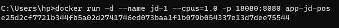

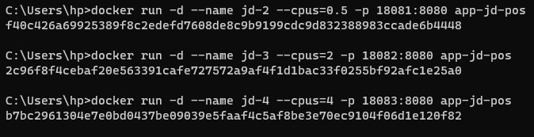

然后通过Gatling对其进行压力测试，其中购物车添加一件产品执行一次，访问根页面执行一次：

（由于仅改变Gatling配置，其他执行均一致，后续其他任务的Gatling部分的运行截图均不再附上，但其生成的结果文件截图仍保留）

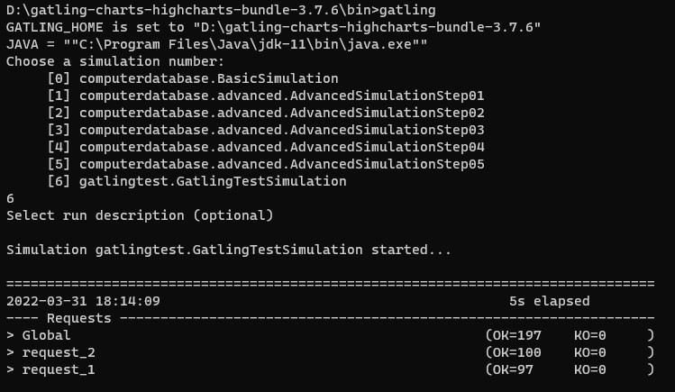

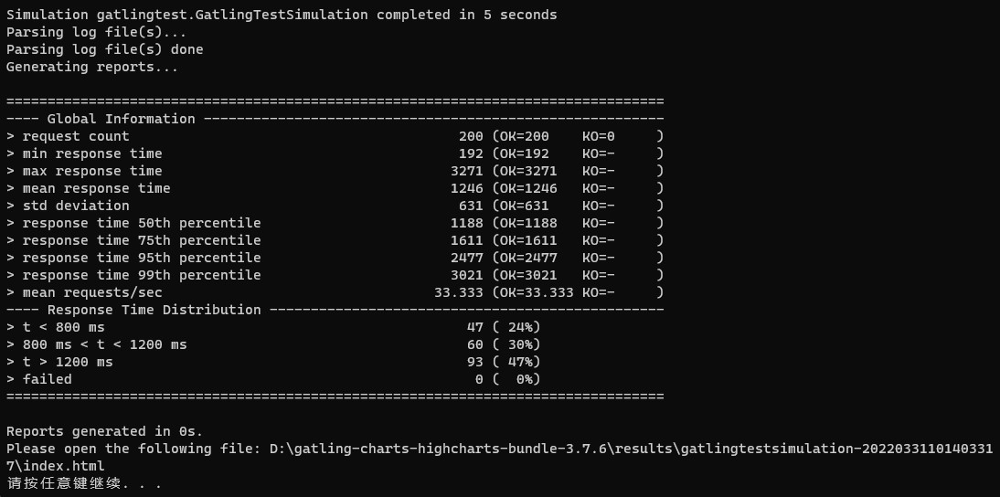

结果分别如下所示：

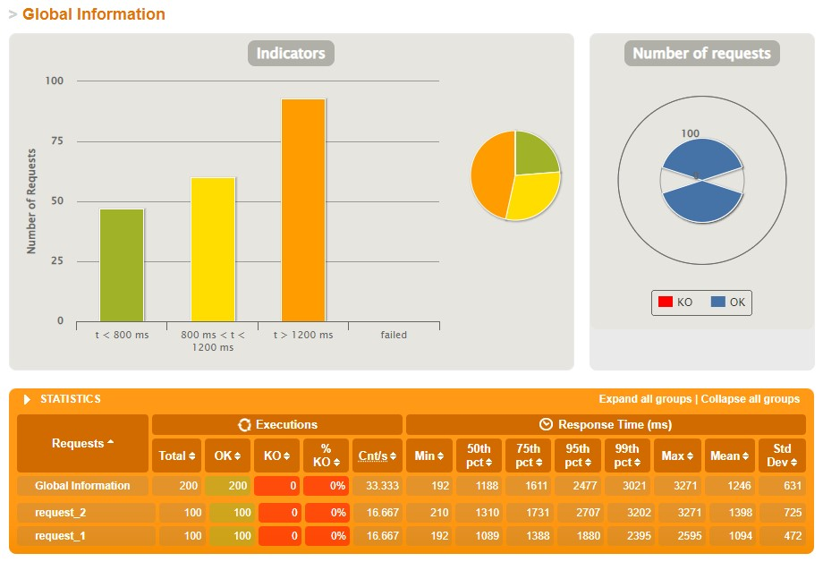

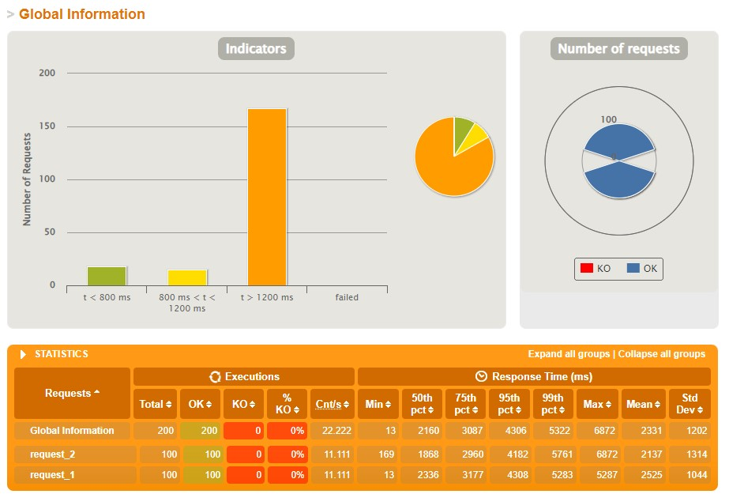

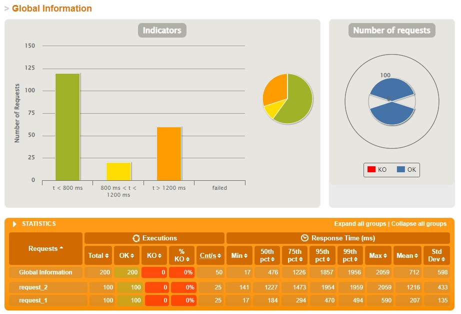

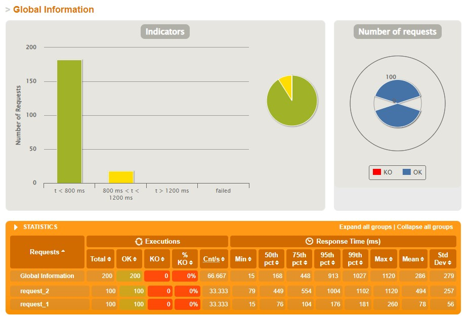

统计如下：

| CPU              | 0.5  | 1    | 2    | 4    |
| ---------------- | ---- | ---- | ---- | ---- |
| 平均响应时间(ms) | 2331 | 1246 | 712  | 286  |
| 最小响应时间(ms) | 13   | 192  | 17   | 15   |
| 最大响应时间(ms) | 6872 | 3271 | 2059 | 1120 |

**结论：垂直扩展可以为单个设备提供更强的运算能力，其增强效果基本正比于硬件扩充的性能。**

#### TASK 2 - 水平扩展

首先生成1份CPU占用为`1`的Docker镜像，并部署到4个端口运行：


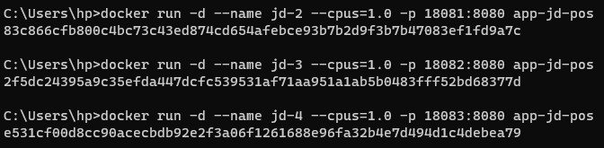

然后在WSL子系统中运行haproxy，其配置如下：

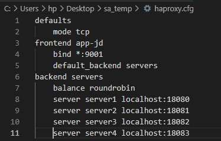

*得益于WSL的支持，子系统与主系统共用网络，本地连接可以跨子系统进行*

通过Gatling对其进行压力测试，测试内容与前一项任务一致，结果分别如下所示：

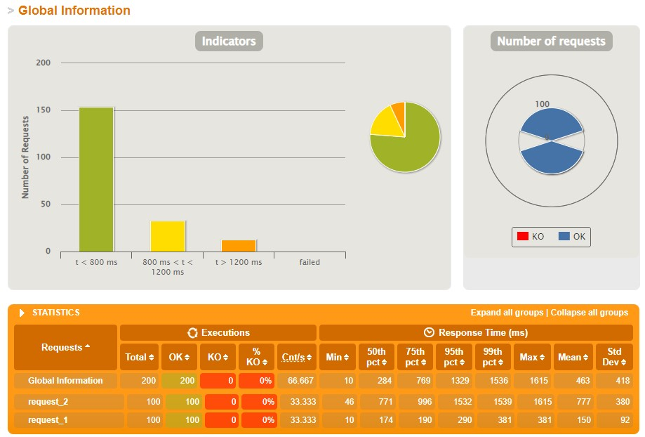

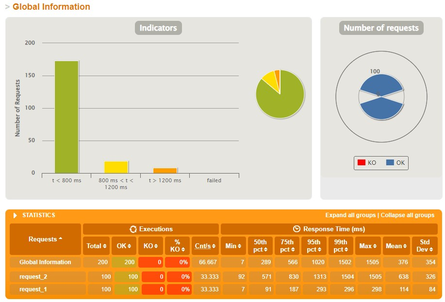

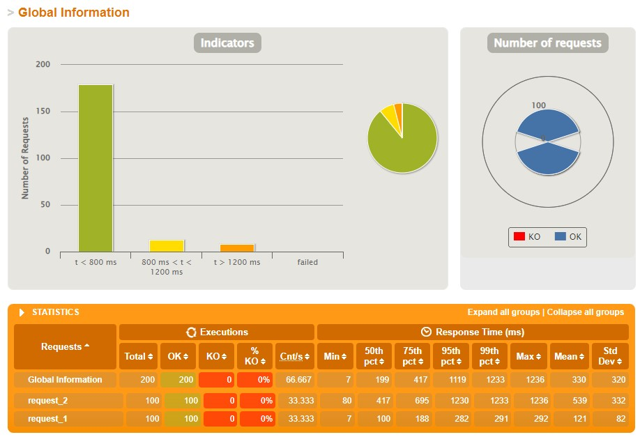

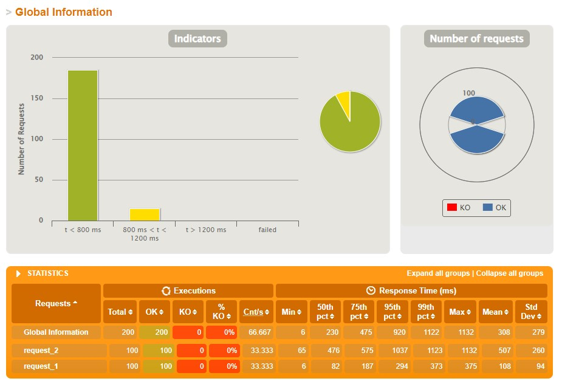

统计如下：

| 运行容器数       | 1    | 2    | 3    | 4    |
| ---------------- | ---- | ---- | ---- | ---- |
| 平均响应时间(ms) | 463  | 376  | 330  | 308  |
| 最小响应时间(ms) | 10   | 7    | 7    | 6    |
| 最大响应时间(ms) | 1615 | 1505 | 1236 | 1132 |

**结论：水平扩展可以将多台设备联接以为更多用户同时提供服务，其增强效果基本正比于设备数。**

#### TASK 3 - 缓存管理与会话控制

选择Redis集群进行缓存管理，Redis进行会话控制。

首先依照视频教学修改项目文件，添加缓存配置和会话，并将购物车与用户会话关联：

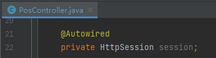

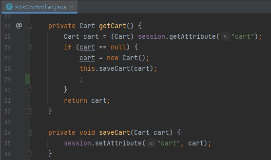

然后在WSL子系统中安装Redis，配置各Redis服务器设置：

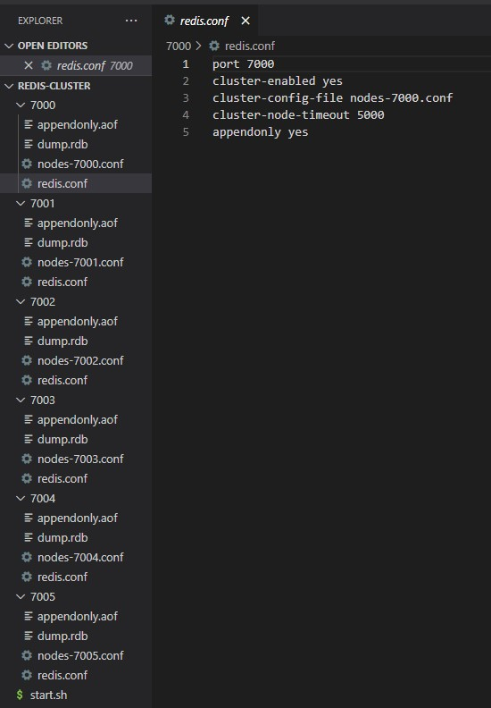

通过终端启动各服务器，并配置为Redis集群；

*该过程中遇到新的问题：主从节点连接中断，从而导致节点反复切换。*

*排查搜索确认问题来源，找到的解决方案：通过设置各Redis服务器的缓存来避免切换频繁：*

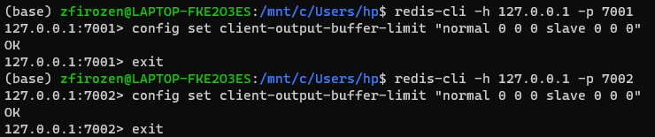

验证确认Redis集群运行状态正常：

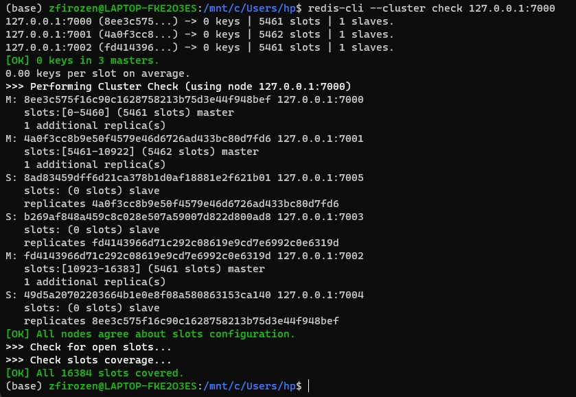

运行程序，根据配置文件，WebPos自动连接到Redis。

首先通过浏览器访问，Redis集群中已经有服务器存储了`session`信息：

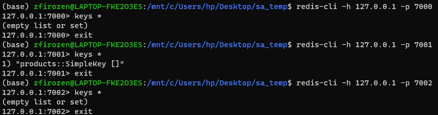

通过Gatling对其进行压力测试，测试内容与前一项任务一致，结果如下所示：

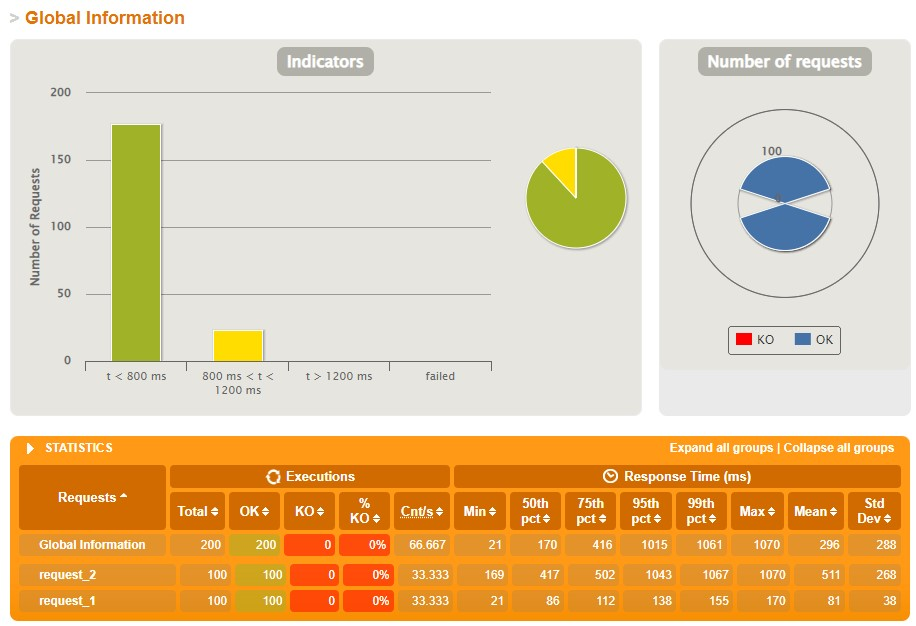

统计如下：

| 平均响应时间(ms) | 最小响应时间(ms) | 最大响应时间(ms) |
| ---------------- | ---------------- | ---------------- |
| 296              | 21               | 1070             |

**结论：通过观察访问时间占比可以发现，增加缓存管理后，平均响应时间有一定下降，特别是访问根页面的`request_1`，降幅更明显；通过会话管理，可以区分隔离不同用户对服务的访问，并使得同一用户总能在同一节点上获得服务。**


## Original README.md

The demo shows a web POS system , which replaces the in-memory product db in aw03 with a one backed by 京东.


To run

```shell
mvn clean spring-boot:run
```

Currently, it creates a new session for each user and the session data is stored in an in-memory h2 db. 
And it also fetches a product list from jd.com every time a session begins.

1. Build a docker image for this application and performance a load testing against it.
2. Make this system horizontally scalable by using haproxy and performance a load testing against it.
3. Take care of the **cache missing** problem (you may cache the products from jd.com) and **session sharing** problem (you may use a standalone mysql db or a redis cluster). Performance load testings.

Please **write a report** on the performance differences you notices among the above tasks.

